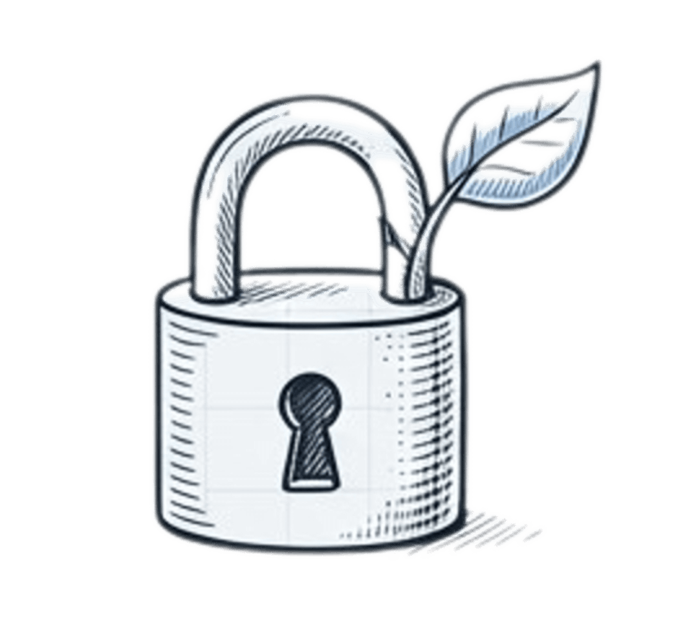

::: {.hero-section}

:::: {.columns}

::: {.column width="50%"}

::: {.hero-badge}
 🔒 Infraestrutura Pública Digital 
:::

# Verificação de [Idade]{.highlight}

<!-- ::: {.hero-description} -->
## Infraestrutura pública digital para proteção de crianças e adolescentes

Comprova que uma pessoa tem 18 anos ou mais, sem revelar sua identidade ou qualquer dado pessoal. Construída sobre padrões abertos e credenciais verificáveis.
<!-- ::: -->
:::

<!-- 

[Entenda como funciona →](como-funciona.html){.btn-primary-govbr}

::: -->
::: {.column width="50%"}

{width=90%}

:::

::::

:::

---

::: {.audience-content}

:::: {.columns}

::: {.column width="55%"}

## Para quem é a Verificação de Idade?

A **Verificação de Idade** é uma infraestrutura pública que beneficia cidadãos, empresas e desenvolvedores. Cada grupo tem um papel específico nesse ecossistema de proteção de crianças e adolescentes.

Selecione acima o perfil que mais se encaixa com a sua situação para entender como funciona para você.

:::

::: {.column width="35%"}

> **Por que isso é importante?**
>
> O Brasil precisa proteger crianças online sem comprometer a privacidade de adultos ou centralizar dados pessoais.

:::

::::

::: {.audience-section}

::: {.audience-tabs}

- [Sou Cidadão](cidadao.html)
- [Sou Negócio](negocio.html)
- [Sou Desenvolvedor](desenvolvedor.html)
- [Sou Jornalista / Gestor](jornalista.html)

:::

:::
:::

::: {.principles-section}

::: {.section-title}
Princípios
:::

::: {.section-divider}
:::

::: {.section-subtitle}
A Verificação de Idade é construída sobre princípios fundamentais que garantem proteção real sem abrir mão de direitos.
:::

:::: {.columns}

::: {.column width="25%"}

::: {.principle-card}

{.principle-icon}

### Privacidade

Nenhum dado pessoal é revelado durante a verificação. O sistema confirma apenas que o usuário tem 18 anos ou mais, sem expor identidade, nome, CPF ou qualquer informação adicional.

:::

:::

::: {.column width="25%"}

::: {.principle-card}

{.principle-icon-interoperable}

### Interoperabilidade

Construído sobre padrões abertos internacionais como W3C Verifiable Credentials e OID4VC (OpenID for Verifiable Credentials), garantindo compatibilidade com sistemas nacionais e internacionais.

:::

:::

::: {.column width="25%"}

::: {.principle-card}

{.principle-icon}

### Soberania

O cidadão mantém controle sobre seus próprios dados. A infraestrutura está sob controle do Estado Brasileiro, sem dependência de plataformas privadas estrangeiras.

:::

:::

::::

:::

---

::: {.howto-section}

::: {.section-title}
Entenda como funciona
:::

::: {.section-divider}
:::

::: {.section-subtitle}
O sistema usa Credenciais Verificáveis para provar maioridade sem revelar identidade. [Entenda cada etapa do processo](como-funciona/como-funciona.qmd).
:::

:::: {.columns}

::: {.column width="20%"}

::: {.howto-card}

::: {.howto-number}
1
:::

### O que é Credencial Verificável

Uma forma segura e privada de provar fatos sobre você sem revelar dados desnecessários.

[Saiba mais →](como-funciona/credencial-verificavel.qmd){.arrow-link}

:::

:::

::: {.column width="20%"}

::: {.howto-card}

::: {.howto-number}
2
:::

### Como comprovar idade sem revelar identidade

O mecanismo técnico que torna possível provar maioridade de forma completamente privada.

[Saiba mais →](comprovar-idade.html){.arrow-link}

:::

:::

::: {.column width="20%"}

::: {.howto-card}

::: {.howto-number}
3
:::

### Jornada do Usuário

Veja passo a passo como um cidadão obtém e usa sua credencial de verificação de idade.

[Saiba mais →](jornada-usuario.html){.arrow-link}

:::

:::

::: {.column width="20%"}

::: {.howto-card}

::: {.howto-number}
4
:::

### Perguntas Frequentes

Tire suas dúvidas sobre a Verificação de Idade.

[Ver FAQ →](faq.html){.arrow-link}

:::

:::

::::

:::

---

::: {.cta-section}

## Plataforma Digital ou Desenvolvedor?

A Verificação de Idade é uma infraestrutura aberta, documentada e disponível para toda a sociedade.

[Acesse a documentação técnica](https://verificaidade.dev){.btn-yellow}

:::
